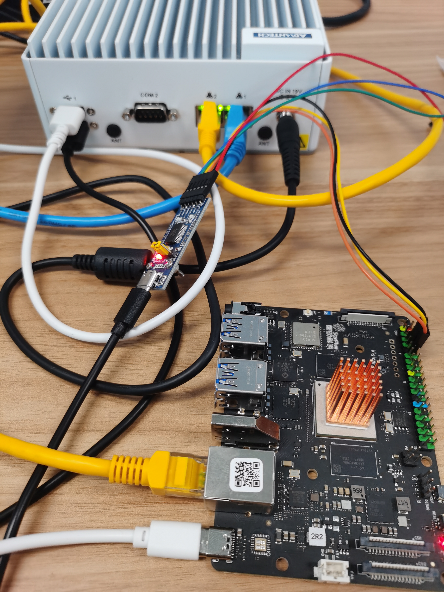

# 在 visionfive 上运行zCore

## 一. visionfive 开发板烧写

> **NOTICE** 本文描述的上位机操作在 Ubuntu20.04 上测试可用

### 1. 在工控机上部署必要服务

```bash
#  部署 dhcpd
# 1. 安装 dhcp3-server
sudo apt install isc-dhcp-server

# 2. 设置 dhcp 服务接口，这个接口为实际的物理网卡接口
vim /etc/default/isc-dhcp-server
------------------------------------------------
INTERFACESv4="enp2s0" # 设置 dhcpv4 端口为 enp2s0
INTERFACESv6=""
------------------------------------------------

# 3. 给这个接口配置 IP 地址，并 up 接口
vim /etc/netplan/01-network-manager-all.yaml
-----------------------------------------------------------
# Let NetworkManager manage all devices on this system
network:
  version: 2
  renderer: NetworkManager
  ethernets:
    eno1:
      addresses: []
      dhcp4: true
      optional: true
    enp2s0:
      addresses: [192.168.10.10/24]
      gateway4: 192.168.10.1
      nameservers:
        addresses: [114.114.114.114,8.8.8.8]
      dhcp4: no
------------------------------------------------------------
sudo netplan appply

# 4. 设置 dhcp 相关配置
vim /etc/dhcp/dhcpd.conf
----------------------------------------------------
subnet 192.168.10.0 netmask 255.255.255.0 {
  range 192.168.10.120 192.168.10.128;
  option routers 192.168.10.10;
  option subnet-mask 255.255.255.0;
  option broadcast-address 192.168.10.255;
  option domain-name-servers 192.168.10.10;
}
-----------------------------------------------------

# 5. 启动 dhcpd 服务
systemctl restart isc-dhcp-server

# 6. 检查 dhcpd 服务状态
systemctl status isc-dhcp-server

#  部署 tftpd
# 1. 安装 tftpd-hpa
sudo apt install tftpd-hpa

# 2. 修改配置
--------------------------------------------------------------
TFTP_USERNAME="tftp"
TFTP_DIRECTORY="/root/work/tftpboot" # 此项为 tftp 文件下载路径
TFTP_ADDRESS=":69"
TFTP_OPTIONS="--secure"
--------------------------------------------------------------

# 3. 启动 tftpd 服务
systemctl restart tftpd-hpa

# 4. 检查 tftpd 服务状态
systemctl status tftpd-hpa
```

### 2. 连接工控机和 visionfive 开发板



```bash
# 圆头黑色线为工控机电源线
# 黄色网线是用来板子 dhcp 获取地址的
# 蓝色网线是工控机用来连接公网下载资源的，这里可以忽略
# 白色 USB 接口是给板子供电的，5v/3A
# 黑色 USB 接口是串口控制台
```

在工控机上打开串口助手（minicom），开发板上电后，过几秒钟会自动进入 u-boot 命令行模式

```bash
Welcome to minicom 2.7.1

OPTIONS: I18n
Compiled on Dec 23 2019, 02:06:26.
Port /dev/ttyUSB0, 12:54:20

Press CTRL-A Z for help on special keys


VisionFive #
VisionFive #
VisionFive #

# 此时可以使用 `help` 查看有哪些可用命令
# 使用 `printenv` 查看配置了哪些环境变量

# 1. 输入 `dhcp` 命令，让开发板获取 IP 地址
# 注意此时可能会自动下载服务器中的镜像, 请通过Ctrl+C打断
dhcp

# 2. 设置 tftp 客户端地址（本机）
setenv ipaddr 192.168.10.121 # 设置 dhcp 获取的那个地址

# 3. 设置 tftp 服务端地址（工控机）
setenv serverip 192.168.10.10 # 需要与自己 IP 在同一网段

# 4. 测试一下网络是否通畅
ping 192.168.10.10 # 试一下ping主机（可选）

# 5. 保存上述配置
saveenv # 保存配置到 flash，之后就不再需要配置
```

### 3. 制作 itb 格式镜像

```bash
# 1. 从 visionfive 官方库下载 `starfive_fb.h` `starfive_vic7100_clk.dtsi` `starfive_vic7100_evb.dts`

# 2. 使用以下命令编译 dtb
cpp -nostdinc -I include -undef -x assembler-with-cpp starfive_vic7100_evb.dts starfive.dts.0

dtc -o starfive.dtb starfive.dts.0	# 预编译的starfive.dtb已放在prebuilt目录

# 3. 压缩内核镜像到 `z.bin.gz`
gzip -9 -cvf z.bin > z.bin.gz

# 4. 制作 itb 文件
mkimage -f zcore-starfive.its z.itb	# zcore-starfive.its即prebuilt目录下的starfive_fdt.its，故也可使用mkimage -f prebuilt/firmware/riscv/starfive_fdt.its z.itb达到相同的效果

下面是 zcore-starfive.its 内容
--------------------------------------------------------------------
/*
 * U-Boot uImage source file for "zCore-visionfive"
 */

/dts-v1/;

/ {
    description = "U-Boot uImage source file for zCore-visionfive";
    #address-cells = <1>;

    images {
        kernel {
            description = "Linux kernel for zCore-visionfive";
            data = /incbin/("./z.bin.gz");
            type = "kernel";
            arch = "riscv";
            os = "linux";
            compression = "gzip";
            load = <0x80200000>;
            entry = <0x80200000>;
        };
        fdt {
            description = "Flattened Device Tree blob for zCore-visionfive";
            data = /incbin/("./starfive.dtb");
            type = "flat_dt";
            arch = "riscv";
            compression = "none";
        };
    };

    configurations {
        default = "conf";
        conf {
            description = "Boot Linux kernel with FDT blob";
            kernel = "kernel";
            fdt = "fdt";
        };
    };
};
--------------------------------------------------------------------

# 5. 将 `z.itb` 放入 tftp 服务器指定的下载路径
cp z.itb /path/to/tftpboot
```

### 4. 上传 itb 文件到开发板内存，并从指定位置启动

```bash
VisionFive #tftpboot 0xc0000000 z.itb
Speed: 1000, full duplex
Using dwmac.10020000 device
TFTP from server 192.168.10.10; our IP address is 192.168.10.121
Filename 'z.itb'.
Load address: 0xc0000000
Loading: ##################################################  1.5 MiB
         11.4 MiB/s
done
Bytes transferred = 1584003 (182b83 hex)
VisionFive #bootm 0xc0000000
## Loading kernel from FIT Image at c0000000 ...
   Using 'conf' configuration
   Trying 'kernel' kernel subimage
     Description:  Linux kernel for zCore-FU740
     Type:         Kernel Image
     Compression:  gzip compressed
     Data Start:   0xc00000e8
     Data Size:    1564993 Bytes = 1.5 MiB
     Architecture: RISC-V
     OS:           Linux
     Load Address: 0x80200000
     Entry Point:  0x80200000
   Verifying Hash Integrity ... OK
## Loading fdt from FIT Image at c0000000 ...
   Using 'conf' configuration
   Trying 'fdt' fdt subimage
     Description:  Flattened Device Tree blob for zCoreFU740
     Type:         Flat Device Tree
     Compression:  uncompressed
     Data Start:   0xc017e2ec
     Data Size:    17270 Bytes = 16.9 KiB
     Architecture: RISC-V
   Verifying Hash Integrity ... OK
   Booting using the fdt blob at 0xc017e2ec
   Uncompressing Kernel Image
   Loading Device Tree to 00000000ff6e1000, end 00000000ff6e8375 ... OK

Starting kernel ...


boot page table launched, sstatus = 0x8000000200046000
kernel (physical): 0000000080200000..0000000085ce70b8
kernel (remapped): ffffffc080200000..ffffffc085ce70b8
device tree:       00000000ff6e1000..00000000ff6e6000

hart0 is booting...
hart1 is the primary hart.

[ 28.007868 WARN  1 0:0 zcore_drivers::builder::devicetree] device-tree: failed to parsing node "gpio@11910000": InvalidParam
[ 28.022102 ERROR 1 0:0 zcore_drivers::irq::riscv_intc] invalid SCAUSE value 0xb!
[ 28.032369 ERROR 1 0:0 zcore_drivers::irq::riscv_intc] invalid SCAUSE value 0xb!
[ 28.074321 WARN  1 0:0 linux_syscall] brk: unimplemented
[ 28.082355 WARN  1 0:0 linux_syscall] brk: unimplemented
[ 28.090609 WARN  1 0:0 linux_syscall::vm] mprotect: unimplemented
[ 28.100315 WARN  1 0:0 linux_syscall::vm] mprotect: unimplemented
[ 28.109179 WARN  1 0:0 linux_syscall] getuid: unimplemented
[ 28.117922 WARN  1 0:0 linux_syscall] getpgid: unimplemented
[ 28.126330 WARN  1 0:0 linux_syscall] setpgid: unimplemented
[ 28.134857 WARN  1 0:0 linux_object::fs::stdio] stdout TCGETS | TIOCSPGRP, pretend to be tty.
[ 28.146419 WARN  1 0:0 linux_object::fs::stdio] stdin TCGETS | TIOCSPGRP, pretend to be tty.
[ 28.157926 WARN  1 0:0 linux_syscall] geteuid: unimplemented
[ 28.166389 WARN  1 0:0 linux_syscall] geteuid: unimplemented
/ #
```

## 二. visionfive 移植问题处理

### 1. 烧录问题

我们使用 `tftpboot 0xc0000000 z.itb` 命令烧录，这个 `0xc0000000` 地址要留足内核解压后的空间。

### 2. 内存映射问题

星光开发板的 u-boot 需要给内核和设备树设置加载位置， 然后通过 `a1` 寄存器将设备树的位置通知内核，实际上设备树被放置到超过 1 GiB 的位置上，而 zCore 只支持 1 GiB，所以报非法内存问题。我们需要修改内存映射布局，修改参考这 2 个commit：

[commit1](https://github.com/rcore-os/zCore/commit/227956d5df401c8f8f2fa746f8aa911d3530637f)

[commit2](https://github.com/rcore-os/zCore/commit/16772b9363d02945863008c6a4639ad1cb37eed4)

### 3. 中断处理中有 bug，需要使用当前核去处理对应中断，修复见

[commit](https://github.com/rcore-os/zCore/commit/55b3145442f0f70c01527c20e87988d26c01a39b)

### 4. 串口驱动

星光开发板支持 `16550` 驱动，只需做相应的代码适配即可，修改见

[commit](https://github.com/rcore-os/zCore/commit/55b3145442f0f70c01527c20e87988d26c01a39b)

### 5. 未注册中断处理

我们发现星光开发板从 `1` 号核心启动后会报一个 `131` 的中断，这个中断在设备树中是没有的，所以也没有在内核中注册，所以会报错，我们在中断处理的时候，将它的优先级降低做屏蔽处理了，见：

[commit](https://github.com/rcore-os/zCore/commit/55b3145442f0f70c01527c20e87988d26c01a39b)
